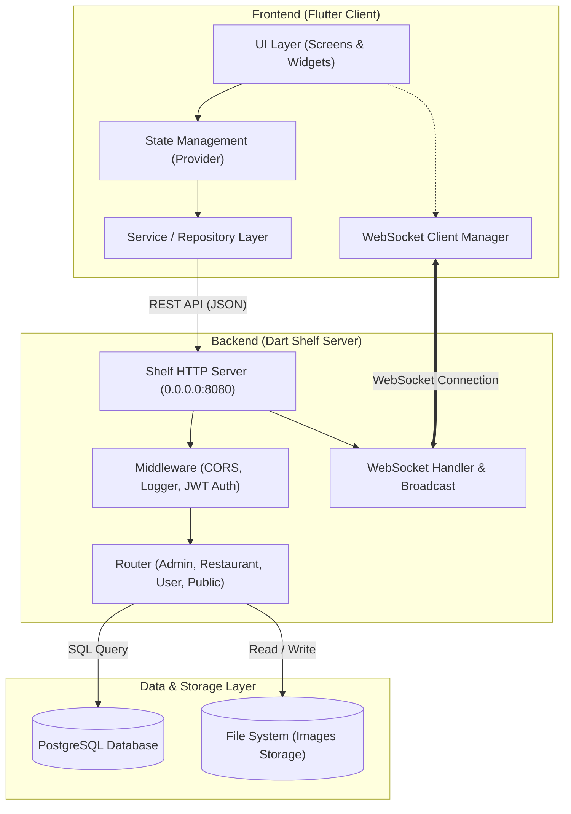

# 🍔 Food Delivery App — Fullstack Flutter & Dart Ecosystem

<div align="center">


**Ứng dụng đặt đồ ăn trực tuyến toàn diện, hiệu năng cao xây dựng trên nền tảng Fullstack Dart: Flutter (Mobile/Web) + Dart Shelf (Backend) + PostgreSQL + Realtime WebSocket.**

[Khám phá tính năng](#-tính-năng-chính) • [Kiến trúc hệ thống](#-kiến-trúc-hệ-thống) • [Cơ sở dữ liệu](#-thiết-kế-cơ-sở-dữ-liệu) • [Cài đặt & Khởi chạy](#-hướng-dẫn-cài-đặt--khởi-chạy) • [API Reference](#-tổng-quan-api)

</div>

---

## 📖 Giới thiệu dự án

**Food Delivery App** là giải pháp phần mềm hoàn chỉnh cho mô hình dịch vụ ẩm thực và giao nhận món ăn theo thời gian thực. Hệ thống được phát triển theo kiến trúc đa vai trò (**Multi-Role Architecture**), phục vụ linh hoạt cho cả **Khách hàng** (đặt món, theo dõi đơn hàng) và **Chủ nhà hàng / Quản trị viên** (quản lý thực đơn, xử lý đơn hàng, theo dõi doanh thu qua Dashboard thống kê trực quan).

Dự án tận dụng tối đa sức mạnh của hệ sinh thái **Dart toàn diện (Fullstack Dart)**:
- **Frontend**: Flutter cross-platform (hỗ trợ Android, iOS, Web, Desktop) với giao diện hiện đại, mượt mà và quản lý trạng thái hiệu quả bằng Provider.
- **Backend**: Dart Shelf REST API Server tốc độ cao, xử lý đa luồng bất đồng bộ (async/await), tích hợp WebSocket đẩy thông báo tức thời.
- **Database**: PostgreSQL quan hệ chặt chẽ, tối ưu truy vấn nghiệp vụ thương mại điện tử và lưu vết hành vi người dùng.

---

## ✨ Tính năng chính

### 👤 1. Phân hệ Khách hàng (Customer)

* **Xác thực & Tài khoản**:
  * Đăng ký, đăng nhập bảo mật với JSON Web Token (JWT).
  * Quản lý phiên đăng nhập an toàn với `SharedPreferences`.
  * Xem và cập nhật thông tin cá nhân, thiết lập địa chỉ giao hàng mặc định.
* **Khám phá món ăn & Nhà hàng**:
  * Xem thực đơn phân loại theo danh mục (Category), trạng thái mở bán (`is_available`).
  * Tìm kiếm món ăn theo tên và từ khóa nhanh chóng.
  * Xem thông tin chi tiết món ăn: hình ảnh, mô tả, giá bán, thời gian chuẩn bị (`preparation_time`), điểm đánh giá trung bình.
  * Xem đánh giá và phản hồi của người dùng trước đó.
* **Giỏ hàng & Đặt hàng**:
  * Thêm/sửa/xóa món ăn trong giỏ hàng (`carts`).
  * Tự động tính toán tổng tiền, hiển thị định dạng tiền tệ Việt Nam (VNĐ).
  * Định vị vị trí giao hàng chính xác qua GPS / Geocoding (`geolocator`, `geocoding`).
  * Chọn hình thức thanh toán (Tiền mặt, Chuyển khoản, v.v.).
* **Quản lý đơn hàng & Thông báo thời gian thực**:
  * Theo dõi tiến trình đơn hàng (Chờ duyệt -> Đang chế biến -> Đang giao -> Hoàn tất -> Đã hủy).
  * Nhận thông báo tức thì qua kết nối **WebSocket** khi trạng thái đơn hàng thay đổi.
  * Xem lịch sử đơn hàng và viết đánh giá, chấm điểm (1 - 5 sao kèm bình luận).

---

### 🏪 2. Phân hệ Chủ nhà hàng (Restaurant Owner)

* **Quản lý nhà hàng**:
  * Cập nhật thông tin quán, địa chỉ và toạ độ địa lý (Latitude, Longitude).
  * Bật/tắt trạng thái đóng/mở cửa quán (`is_open`).
* **Quản lý thực đơn (Food Management)**:
  * Thêm món ăn mới với tải lên hình ảnh trực tiếp (Multipart Form Data).
  * Cập nhật giá, mô tả, danh mục và thời gian chuẩn bị.
  * Đổi trạng thái món còn bán hay tạm hết hàng tức thì.
* **Quản lý đơn hàng (Order Management)**:
  * Tiếp nhận đơn hàng mới theo thời gian thực.
  * Cập nhật trạng thái xử lý đơn hàng và trạng thái thanh toán.
  * Xem thông tin chi tiết người đặt, địa chỉ giao hàng và danh sách món chi tiết.
* **Dashboard Báo cáo & Thống kê chuyên sâu**:
  * Biểu đồ trực quan hoá doanh số (sử dụng `fl_chart` và `syncfusion_flutter_charts`).
  * **Tổng quan**: Tổng doanh thu, tổng số đơn đặt, sản phẩm đã bán, số lượng khách hàng.
  * **Thống kê doanh thu theo mốc thời gian**: Theo giờ, theo ngày, theo tháng.
  * **Phân tích sản phẩm**: Bảng xếp hạng Top món ăn bán chạy nhất, doanh thu theo từng món ăn.
  * **Phân bố trạng thái đơn hàng**: Biểu đồ tròn thể hiện tỷ lệ hoàn thành/hủy đơn.

---

### 🔐 3. Bảo mật & Cơ sở hạ tầng

* **JWT Authentication**: Cấp phát và xác thực token trên mỗi request cần bảo vệ.
* **Role-Based Authorization (RBAC)**: Phân quyền truy cập rõ ràng giữa `Admin`, `Restaurant`, `Staff`, `User`.
* **CORS & Middleware**: Quản lý truy cập liên tên miền, ghi log request chuẩn xác.
* **Static File Server**: Cung cấp đường dẫn phục vụ hình ảnh upload (`/image_foods/...`).
* **Realtime Notification Service**: Tích hợp WebSocket kết nối trực tiếp Client - Server để push thông báo tự động.

---

## 🏗 Kiến trúc hệ thống



---

## 🗄 Thiết kế cơ sở dữ liệu

Hệ thống được thiết kế với cơ sở dữ liệu quan hệ **PostgreSQL**, đảm bảo tính toàn vẹn dữ liệu:

| Bảng | Chức năng chính |
| :--- | :--- |
| `users` | Lưu trữ tài khoản, thông tin liên hệ, mật khẩu băm, vai trò (`role`) và địa chỉ mặc định |
| `role` | Định nghĩa các quyền: Admin, Restaurant, Staff, User |
| `status_domain` & `status` | Quản lý trạng thái động (trạng thái đơn hàng, trạng thái thanh toán, tài khoản) |
| `restaurants` | Thông tin nhà hàng, chủ sở hữu (`owner`), tọa độ vị trí (Lat, Long), trạng thái mở cửa |
| `category` | Danh mục món ăn dùng chung cho hệ thống |
| `foods` | Thông tin món ăn, hình ảnh, đơn giá, thời gian làm món, xếp hạng đánh giá |
| `bills` | Hóa đơn đặt hàng, lưu trữ thời gian, địa chỉ giao, số điện thoại, trạng thái |
| `detail_bill` | Chi tiết các món trong hóa đơn và số lượng tương ứng |
| `method_payment` & `payments` | Phương thức thanh toán (COD, Chuyển khoản...) và trạng thái thanh toán đơn hàng |
| `carts` | Giỏ hàng tạm thời của từng người dùng |
| `reviews` | Đánh giá sao (1-5) và bình luận trải nghiệm món ăn từ người dùng |
| `notifications` & `notification_types` | Thông báo hệ thống có phân loại, lưu payload dạng JSONB |
| `user_food_log` & `action` | Lưu vết tương tác người dùng phục vụ phân tích dữ liệu và gợi ý |

---

## 🛠 Công nghệ sử dụng

### Frontend (Client)
- **Framework**: [Flutter](https://flutter.dev/) (Dart SDK `^3.9.0`)
- **State Management**: [Provider](https://pub.dev/packages/provider)
- **Networking**: `http`, `web_socket_channel`
- **Charts & Data Visualization**: `fl_chart`, `syncfusion_flutter_charts`
- **Location Services**: `geolocator`, `geocoding`
- **UI Components & Utilities**: `carousel_slider`, `image_picker`, `file_picker`, `shared_preferences`, `intl`

### Backend (Server)
- **Ngôn ngữ**: [Dart SDK](https://dart.dev/)
- **Micro-framework**: [Shelf](https://pub.dev/packages/shelf), [shelf_router](https://pub.dev/packages/shelf_router)
- **Realtime**: `shelf_web_socket`, `web_socket_channel`
- **Bảo mật**: `dart_jsonwebtoken`, `shelf_cors_headers`
- **File Upload**: `multipart`, `mime`, `http_parser`
- **Database Driver**: [postgres](https://pub.dev/packages/postgres) (PostgreSQL v3 driver)

---

## 📁 Cấu trúc thư mục

```text
food_ordering_app/
├── backend/                        # Nguồn mã nguồn máy chủ (Dart Shelf)
│   ├── bin/
│   │   └── backend.dart            # Điểm khởi chạy server, WebSocket & Pipeline
│   ├── lib/
│   │   ├── auth/                   # Xử lý xác thực JWT (Login, Register, Token verify)
│   │   ├── core/
│   │   │   └── config/             # Cấu hình DB, tự động migrate bảng (setup_database.dart)
│   │   ├── roles/                  # Phân tầng nghiệp vụ theo vai trò
│   │   │   ├── admin/              # Nghiệp vụ quản trị hệ thống
│   │   │   ├── public/             # API công khai (xem món, xem quán không cần đăng nhập)
│   │   │   ├── restaurant/         # Quản lý quán ăn, món ăn, thực đơn, dashboard
│   │   │   └── user/               # Giỏ hàng, tạo đơn hàng, profile, đánh giá
│   │   ├── routes/
│   │   │   └── routes.dart         # Tập hợp và gắn router cho toàn hệ thống
│   │   ├── shared/                 # Dịch vụ dùng chung (xử lý hình ảnh tĩnh, upload)
│   │   └── websocket/              # Quản lý kết nối và bắn thông báo real-time
│   ├── public/image_foods/         # Thư mục lưu trữ hình ảnh món ăn upload lên
│   └── pubspec.yaml                # Cấu hình thư viện Backend
│
├── frontend/                       # Ứng dụng di động / web (Flutter)
│   ├── lib/
│   │   ├── core/                   # Cấu hình chung, constants, model dùng chung, theme
│   │   │   ├── config/             # Cấu hình IP Host, Port, Format tiền tệ
│   │   │   └── models/             # Định nghĩa cấu trúc dữ liệu Model
│   │   ├── features/               # Module hóa theo tính năng
│   │   │   ├── auth/               # Màn hình & Provider Đăng ký / Đăng nhập
│   │   │   ├── restaurant/         # Quản lý món, đơn hàng & Dashboard biểu đồ
│   │   │   └── user/               # Trang chủ, Chi tiết món, Giỏ hàng, Đơn hàng, Đánh giá
│   │   ├── public_service/         # Dịch vụ gọi API công khai
│   │   ├── websocket/              # Quản lý kết nối Stream WebSocket nhận thông báo
│   │   └── main.dart               # Điểm khởi chạy ứng dụng Flutter
│   └── pubspec.yaml                # Cấu hình thư viện Frontend
│
└── README.md                       # Tài liệu hướng dẫn dự án
```

---

## 🚀 Hướng dẫn cài đặt & khởi chạy

### 📋 Yêu cầu tiên quyết
- Đã cài đặt **Flutter SDK** (khuyến nghị phiên bản `>= 3.24.0` tương ứng Dart SDK `^3.9.0`).
- Đã cài đặt và đang chạy **PostgreSQL Server** (mặc định cổng `5432`).
- Một trình giả lập Android / iOS hoặc thiết bị thật kết nối cùng mạng LAN.

---

### Bước 1: Khởi tạo cơ sở dữ liệu PostgreSQL
1. Mở công cụ quản trị (pgAdmin hoặc DBeaver hoặc Terminal psql) và tạo một database mới:
   ```sql
   CREATE DATABASE app_ordering;
   ```
2. Kiểm tra thông tin kết nối trong file `backend/lib/core/config/config.dart`:
   ```dart
   const String dbHost = 'localhost';
   const int dbPort = 5432;
   const String dbName = 'app_ordering';
   const String dbUsername = 'postgres';
   const String dbPassword = 'YOUR_DB_PASSWORD'; // Cập nhật mật khẩu của bạn
   ```
   *(Hệ thống sẽ tự động khởi tạo toàn bộ các bảng khi khởi chạy server lần đầu).*

---

### Bước 2: Cài đặt và khởi chạy Backend
1. Di chuyển vào thư mục `backend`:
   ```bash
   cd backend
   ```
2. Tải các dependencies:
   ```bash
   dart pub get
   ```
3. Chạy server:
   ```bash
   dart run bin/backend.dart
   ```
   Khi màn hình console hiển thị:
   ```text
   Database ready
   Server running at http://0.0.0.0:8080
   ```
   Backend đã sẵn sàng nhận kết nối HTTP và WebSocket.

---

### Bước 3: Cài đặt và khởi chạy Frontend
1. Di chuyển vào thư mục `frontend`:
   ```bash
   cd ../frontend
   ```
2. Cập nhật cấu hình IP máy chủ tại `frontend/lib/core/config/config.dart`:
   * Chạy trên **Chrome / Web / Windows Desktop**: giữ nguyên `localhost` hoặc `127.0.0.1`.
   * Chạy trên **Android Emulator**: đổi sang `10.0.2.2`.
   * Chạy trên **Thiết bị thật (Real Phone)**: đổi thành địa chỉ IP mạng nội bộ của máy tính chạy server (ví dụ: `192.168.1.x`).
3. Tải các gói thư viện Flutter:
   ```bash
   flutter pub get
   ```
4. Khởi chạy ứng dụng:
   ```bash
   flutter run
   ```

---

## 📡 Tổng quan API

| Module | Method | Endpoint | Mô tả | Yêu cầu xác thực |
| :--- | :---: | :--- | :--- | :---: |
| **Auth** | `POST` | `/auth/login` | Đăng nhập tài khoản, trả về JWT Token | Không |
| **Auth** | `POST` | `/auth/register` | Đăng ký tài khoản người dùng mới | Không |
| **Public** | `GET` | `/public/foods` | Lấy danh sách món ăn đang mở bán | Không |
| **Public** | `GET` | `/public/restaurants` | Lấy danh sách thông tin nhà hàng | Không |
| **User** | `GET` | `/user/cart` | Lấy thông tin giỏ hàng hiện tại | Bearer Token |
| **User** | `POST` | `/user/cart/add` | Thêm món ăn vào giỏ hàng | Bearer Token |
| **User** | `POST` | `/user/order` | Tiến hành đặt đơn hàng mới | Bearer Token |
| **User** | `GET` | `/user/orders` | Xem lịch sử đơn hàng của người dùng | Bearer Token |
| **Restaurant** | `GET` | `/restaurant/orders` | Danh sách đơn hàng đặt tới quán | Role: Restaurant |
| **Restaurant** | `PUT` | `/restaurant/orders/:id` | Cập nhật trạng thái xử lý đơn hàng | Role: Restaurant |
| **Restaurant** | `POST` | `/restaurant/foods` | Thêm món ăn mới (hỗ trợ multipart upload) | Role: Restaurant |
| **Restaurant** | `GET` | `/restaurant/dashboard` | Dữ liệu thống kê doanh thu và phân tích | Role: Restaurant |
| **Realtime** | `WS` | `ws://host:port?userId={id}` | Kết nối WebSocket nhận thông báo | Realtime Stream |

---

## 🔮 Kế hoạch phát triển (Roadmap)

- [ ] **Tích hợp cổng thanh toán trực tuyến**: Hỗ trợ VNPAY, MoMo, ZaloPay và thẻ thanh toán quốc tế.
- [ ] **Bản đồ trực tiếp**: Tích hợp Google Maps SDK để theo dõi vị trí shipper di chuyển thời gian thực.
- [ ] **AI Recommendation Engine**: Gợi ý món ăn thông minh dựa trên lịch sử xem món và đặt hàng (`user_food_log`).
- [ ] **Chat trực tuyến**: Hệ thống tin nhắn thời gian thực giữa Khách hàng và Quán ăn.
- [ ] **Dockerization**: Đóng gói dự án với `Dockerfile` và `docker-compose` cho môi trường deploy production nhanh chóng.

---

## 📄 Bản quyền (License)

Dự án được phân phối theo giấy phép [MIT License](LICENSE). Bạn hoàn toàn có thể sử dụng cho mục đích học tập, nghiên cứu và phát triển dự án thực tế.